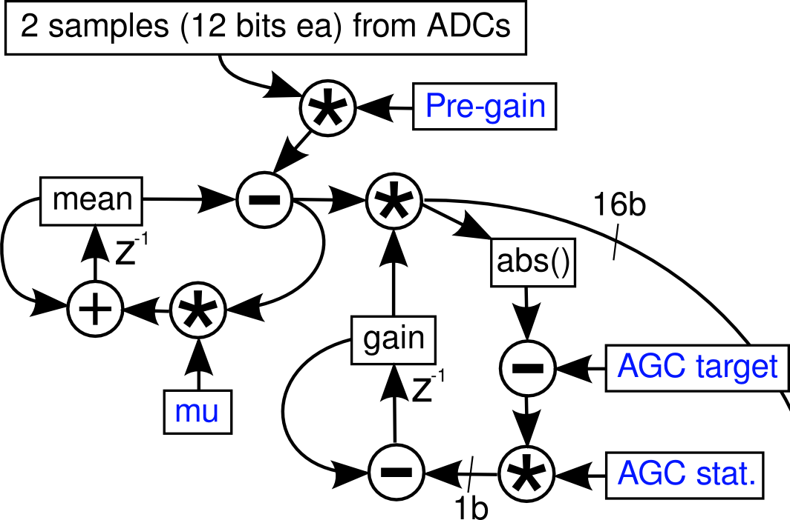

I have been working on improving our lab's [wireless headstage](http://github.com/tlh24/myopen) using Analog Device's Blackfin BF532, Intan's analog 32-channel amplifiers RHA2136, and Nordic's NRF24L01 2.4MHz transceivers. 
The improvement is replacing the RHA2136 with Intan's digital version, RHD2136. There are 4 RHA2136 per headstage in the original headstage, each of which requires a voltage regulator and ADC, both of which can be eliminated when using RHD2136. The resulting (ideally working) board would be half the size.

The PCBs have been made. I originally imagined the firmware changes to be minimal -- essentially changing how BF532 would talk to the amplifiers through SPI, while keeping most of the signal chain code constant. The code architecture should not have to change much.

However, it has proved to be a lot more difficult than the expected plug-and-play scenario. One of the first issues was to first get [Blackfins to talk to the Intans correctly via SPORT]. Then I ran into the problem where the original signal chain code in between sample conversions were too long and resulted in data corruption. Therefore, I need to pick parts of the signal chain to cut and modify.

This post documents my work to understand and adapt the integrator-highpass-AGC, the first stage of the signal chain.

**Background**
The general idea of this wireless system is that, we would acquire samples from four amplifiers at the same time, and then do processing on two of theses samples at a time. Signals at the different stages of the signal chain can be streamed to gtkclient - the PC GUI for display and for spike-sorting. The samples are displayed in a plexon-style interface, and templates are made using PCA. These templates are then sent back to the headstage. In the final firmware, at the end of the signal chain, template matching are done using those results, and a match (or a spike) is found if 16 samples on a given channel is within a certain "aperture" of the templates. (The template is a 16-point time-series. Aperture is the L1-norm of the difference between the template and the most recent 16-samples of the current channel) 

Because of this, it would be nice to keep the input signal to template matching at a stable level -- a signal with the correct spiking shape, but different signal amplitude may not be catagorized as a match. Thus enters [Automatic Gain Control (AGC)](http://en.wikipedia.org/wiki/Automatic_gain_control).

The basic idea is that, the user sets a reference level for the signal power. If the signal power is above this reference level, then decrease the front-end gain. If it is below, then increase it. There are all kinds of fancy implementation, including using different attack/release rate (different gain increasing/decreasing rate). In terms of embeded system, I find [this thread](www.dsprelated.com/showthread/comp.dsp/21943-1.php), and "TI DSP Applications With the TMS320 Family, Theory, Algorithms and Implementations Volume 2" (pages 389-403) to be helpful in understanding how it works.

Tim describes the firmware in his [thesis, page 162](http://m8ta.com/tim/dissertation.pdf):
> Four samples from each of the 4 ADCs are read at once; as the blackfin works efficiently with two 16-bit samples at once, two samples (from two of the 4 headstages) are then processed at a time. These two come in at 12 bits unsigned, and must be converted to 1.15 signed fixed-point, which is done by pre-gain (usually 4) followed by an integraotr highpass stage. The transfer function of the high pass stage is H(z)=4(1-z^-1)/(1-z^-1(1-mu)); the normal value of mu is 800/16384 [...] This is followed by an AGC stage which applies a variable gain 0-128 in 7.8 fixed-point format; the absolute value of the scaled sample is compared to the AGC target (stored as the square root to permit 32-bit integers) and the difference is saturated at 1 bit plus sign. This permits the gain to ramp from 0 to 127.999 in 2^15 clocks.

The accompanying diagram is shown below:

Below is the firmware related to this part - it is obvious now I understand how it works, and Tim's thesis explanations now makes perfect sense (it did before, but they seemed more like clues to an elaborate puzzle).


1 |     //read in the samples -- SPORT0
2 |     r0 = w[p0] (z); // SPORT0-primary: Ch0-31
3 |     r1 = w[p0] (z); // SPORT0-sec:     Ch32-63
4 |     r2.l = 0xfff;
5 |     r0 = r0 & r2;
6 |     r1 = r1 & r2;
7 |     r1 <<= 16;  //secondary channel in the upper word.
8 |     r2 = r0 + r1;
9 |        
10|     //apply integrator highpass + gain (2, add twice)).
11|     r5 = [i0++]; //r5 = 32000,-16384. (lo, high)
12|    .align 8
13|        a0 = r2.l * r5.l, a1 = r2.h * r5.l || r1 = [i1++]; // r1 = integrated mean
14|        a0 += r2.l * r5.l, a1 += r2.h * r5.l || r6 = [i0++]; //r6 = 16384 (0.5), 800 (mu)
15|        r0.l = (a0 += r1.l * r5.h), r0.h = (a1 += r1.h * r5.h) (s2rnd);
16|        a0 = r1.l * r6.l , a1 = r1.h * r6.l; //integrator
17|        r2.l = (a0 += r0.l * r6.h), r2.h = (a1 += r0.h * r6.h) (s2rnd)
18|
19|        /*AGC*/	|| r5 = [i1++] || r7 = [i0++]; //r5 = gain, r7 AGC targets (sqrt)
20|        a0 = r0.l * r5.l, a1 = r0.h * r5.h || [i2++] = r2; //save mean, above
21|        a0 = a0 << 8 ; // 14 bits in SRC (note *4 above), amp to 16 bits, which leaves 2 more bits for amplification (*4)
22|        a1 = a1 << 8 ; //gain goes from 0-128 hence (don't forget about sign)
23|        r0.l = a0, r0.h = a1 ;  //default mode should work (treat both as signed fractions)
24|        a0 = abs a0, a1 = abs a1;
25|        r4.l = (a0 -= r7.l * r7.l), r4.h = (a1 -= r7.h * r7.h) (is) //subtract target, saturate, store difference
26|            || r6 = [i0++]; //r6.l = 16384 (1), r6.h = 1 (mu)
27|        a0 = r5.l * r6.l, a1 = r5.h * r6.l || nop; //load the gain again & scale.
28|        r3.l = (a0 -= r4.l * r6.h), r3.h = (a1 -= r4.h * r6.h) (s2rnd) || nop; //r6.h = 1 (mu); within a certain range gain will not change.
29|    .align 8
30|        r3 = abs r3 (v) || r7 = [FP - FP_WEIGHTDECAY]; //set weightdecay to zero to disable LMS.
31|        r4.l = (a0 = r0.l * r7.l), r4.h = (a1 = r0.h * r7.l) (is) || i1 += m1 || [i2++] = r3;
32|                    //saturate the sample (r4), save the gain (r3).


Line 2-8 stores the 12-bit samples in the LO and HI 16-bits of r2.

Line 13 and 14 implement the pre-gain. r5.l=32000=0x7d00 is 0.9765625 in Q15. Multiplying a 12-bit number by 0x7d00 in blackfin's default mode is equivalent of converting the 12-bit UNSIGNED sample into signed Q15 format. This IS VERY IMPORTANT as I shall see later. Line 14 does it again and then add to the original result. This means by line 15, a0 and a1 contains the original samples multiplied by 2 (although r5.l should really be 0x7fff, which is closer to 1 than 0x7d00 in Q15).

In algebraic form
